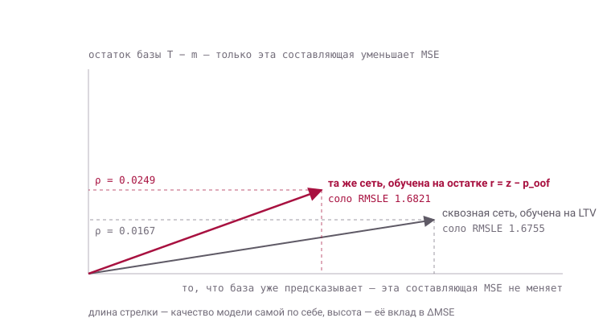

# E-CUP 2026, задача 3 (Search LTV)
---

## Что здесь

Модель и способ её отправки - разные вещи, и репозиторий их не смешивает.

**Модель.** Последовательная сеть над дневной активностью пользователя, обученная
не на таргете, а на ошибке табличного GBDT. Воспроизводится из `train.parquet`
целиком.

**Сборка отправки.** Каждый публичный счёт даёт одно линейное уравнение на
ковариацию нашего направления со скрытым таргетом. 

Финальная цепочка - второе, применённое поверх первого:

```
sub_stage12_base.csv                     1.6472134360
  + 0.092360 · SEQ408
sub_stage12_ref.csv                      1.6470414912
  + ось snap6_unique
sub_stage13_base.csv                     1.6468651642
  − 0.200802 · snap5_unique
  − 0.137092 · mid_contrast
  − 0.131689 · seq_orth
  + 0.083238 · hetero_gate
sub_stage13_ref.csv                      1.6466536668     <--- финальный результат
```

Обе сборки пересчитываются из файлов в `submissions/`:

```
src/s12_submission.py  ->  submission_stage12.csv   rms 8.9e-03,  3.0e-05 дисперсии
src/s13_final.py       ->  submission_final.csv     rms 4.9e-03,  9.0e-06 дисперсии
```

Остаток в обоих случаях - обрезка `expm1` в нуле, а не пропущенная модель.

---

## Запуск

```bash
pip install -r requirements.txt
```

Положите `train.parquet` в `data/`. Дальше:

```bash
py -3.11 run_all.py
```

Один вход, четырнадцать стадий, каждая пропускается если её выход уже на месте -
конвейер можно останавливать и продолжать.

```bash
py -3.11 audit.py                   полная проверка репозитория, 12 разделов
py -3.11 run_all.py --list          состояние стадий
py -3.11 run_all.py --only 09       одна стадия
py -3.11 run_all.py --from 07       с этой и дальше
py -3.11 run_all.py --skip-train    без двух GPU-обучений
py -3.11 check_pipeline.py          граф зависимостей: что из чего выводится
```

Про запуск на другом наборе данных - раздел
[Другой набор данных](#другой-набор-данных): требования к файлу, что
пересчитается.

`audit.py` - первое, что стоит запустить после клонирования. Он проверяет
синтаксис всех файлов, установленные зависимости, существование каждого пути в
коде, ключи конфигов, состав артефактов, отрабатывают ли стадии
11–13 без сырых данных, и совпадают ли пересобранные отправки с эталонами.
Ненулевой код возврата, если что-то не так.

Каждая стадия - самостоятельный скрипт в `src/`, его можно запустить и отдельно.
Время измерено на железе из раздела ниже; у стадий 07, 09 и 10 оно от исходного
прогона, остальные перемерены.

| ст | скрипт | что делает | время |
|---|---|---|---|
| 01 | `s01_features_base.py` | агрегаты по окнам → `X.npy` (202 колонки, 199 в обучении) | 81 с |
| 02 | `s02_features_spans.py` | непересекающиеся интервалы → `X2.npy` (55, 48 в обучении) | 127 с |
| 03 | `s03_features_ranks.py` | ранги внутри якоря → `X4.npy` (48) | 21 с |
| 04 | `s04_features_x6.py` | затухания, покупки, максимумы → `X6.npy` (79) | 7 мин |
| 05 | `s05_oof_panel.py` | панель остатков без утечки, purge 42 | 10.5 мин |
| 06 | `s06_run_pack.py` | календарь и порядок пользователей | секунды |
| 07 | `s07_basis.py` | шесть направлений базиса + вторая база | ~40 мин |
| 08 | `s08_packs.py` | пакеты обучения для 378 и 408 | 3 с |
| 09 | `s09_train_deploy.py` | **SEQ408 на границе 408** → отправка | ~59 мин, GPU |
| 10 | `s10_train_validation.py` | SEQ408 на 378 → доказательство | ~76 мин, GPU |
| 11 | `s11_report.py` | двухстадийный отчёт | секунды |

Стадии 01–11 - вычисление: запустил и получил. Последние две устроены иначе.

| ст | скрипт | что делает | время |
|---|---|---|---|
| 12 | `s12_submission.py` | база + `t` · SEQ408 | секунды |
| 13 | `s13_final.py` | сборка из измеренных осей | секунды |

Это **аналитическая часть**: они не обучают ничего, а решают линейную систему,
коэффициенты которой оцениваются по обратной связи метрики. `run_all.py` пересчитывает
их из готовых `config/*.json`, но новое направление так не появится - под него
сначала нужно измерить коэффициент.
Разбор ниже: [Стадии 12–13](#стадии-1213-аналитическая-часть).

И одна стадия сбоку, не участвующая в воспроизведении отправленного результата:

| ст | скрипт | что делает | время |
|---|---|---|---|
| 14 | `s14_base_deploy.py` | самодостаточная база на границе 408 | 111 с |

Она нужна на другом наборе данных, где отправленной базы нет: см.
[Другой набор данных](#другой-набор-данных).

Признаковый набор - `meta(199) + meta2(48) + meta4(48) = 295` колонок. В файлах
колонок больше: из `X.npy` (202) выброшены `history_days`, `anchor_dow`,
`anchor_doy`, из `X2.npy` (55) - семь `global_names`, одинаковых у всех
пользователей внутри якоря. `X6` (79 колонок) участвует только в направлении
`nd_plain` из базиса.

**Железо.** 16 физических ядер, 32 ГБ RAM, RTX 4080 SUPER. Два важных уточнения: LightGBM
здесь не масштабируется дальше ~12 потоков (`num_threads=12, force_row_wise=True`),
а индексация memmap массивом индексов уходит на путь случайного сбора - держите
выборку строк срезами, иначе сборка 5.5 млн строк занимает 20 минут вместо 8 секунд.

---

## Итоговая модель: SEQ408 на границе 408

Дилатированная TCN над дневной активностью, обученная не на таргете, а на том,
**что табличный GBDT предсказывает неправильно**:

```
r(u, a) = z_true(u, a) - z_gbdt_oof(u, a)
```

В отправку идёт не предсказание сети, а её центрированное направление, добавленное
к базе в лог-пространстве с одним коэффициентом:

```
z = log1p(база) + t · centered(pred_seq11_408),   t = 0.092360
```

### Почему сеть учит ошибку базы, а не сам таргет

Это не приём экономии времени. Это следствие того, как устроено снижение ошибки,
когда решение собирается из нескольких моделей.

Пусть база `m` уже есть и мы добавляем к ней направление `d` с весом `a`:

```
MSE(a) = E[(m + a·d − T)²]

a* = C / V,      C = E[d · (T − m)],   V = E[d²]
ΔMSE = C² / V = ρ² · Var(T − m),       ρ = corr(d, T − m)
```

Снижение ошибки зависит **только** от корреляции направления с остатком базы. Та
часть модели, которая коллинеарна уже предсказанному, не даёт ничего - совсем,
при любом собственном качестве. Модель, предсказывающая всё, оптимизирует сумму
двух слагаемых, из которых в ΔMSE входит ровно одно, и не знает, какое именно.

Геометрически это выглядит так. Любое направление раскладывается на составляющую
вдоль того, что база уже предсказывает, и составляющую поперёк - вдоль остатка
базы. В `ΔMSE` входит только вторая. Обе стрелки ниже - это одна и та же
архитектура, обученная на двух разных целях, и обе величины измерены на одном
холдауте:

<picture>
  <source media="(prefers-color-scheme: dark)" srcset="docs/blend_geometry_dark.svg">
  
</picture>

Стрелка сквозной сети длиннее - соло она лучше. Но она сильнее наклонена к тому,
что база уже знает, и её проекция на остаток меньше: `0.0167` против `0.0249`.
`ΔMSE` идёт как `ρ²`, поэтому разница в проекции в 1.5 раза даёт разницу вклада в
2.2 раза - в пользу той сети, которая соло **хуже**. Числа и способ их получения -
в разделе [Против сквозной модели](#против-сквозной-модели-это-измерено-а-не-заявлено).

Отсюда пять следствий, и все пять здесь измеримы.

**1. Ёмкость и градиенты.** Дисперсия таргета
`V_T = 5.3671`; всё, что приносит новая ортогональная часть, - `dMSE_novel
0.001029`, меньше 0.02 % этой дисперсии. В лоссе по таргету эта часть - того же
порядка малости, и её градиент тонет в градиенте того, что GBDT и так знает
наизусть. В лоссе по остатку она составляет 100 % задачи. Архитектура и стоимость
параметров те же - разница только в том, на что они потрачены.

**2. Исчезает стимул дублировать базу.** При обучении прямо на таргете
наблюдалось устойчиво: чем лучше последовательная модель становилась в таргете,
тем **менее** ортогональной стеку она была. Это не парадокс, а прямое следствие
формулы выше - обучение на таргете поощряет воспроизведение того, что уже
предсказано, а в `ΔMSE` эта часть не входит. Остаточная цель убирает этот стимул
в самом лоссе, а не поправками после обучения.

**3. Остаток честный, потому что он OOF.** `r` считается по панели
`oof_panel.npz` с `purge 42`: база для анкора `a` обучена только на анкорах
`≤ a−42`. Сеть учит ошибку, которую база делает на якоре, которого не было в её обучении - 
ни сам якорь, ни соседние, чьи 30-дневные окна перекрывались бы с ним.
Если взять in-sample остаток, сеть выучит переобучение базы и аккуратно перенесёт его
в отправку - это не гипотеза, а то, что произошло на этапе разработки и стоило
93.8 % заголовочного числа (см. [Что сказала валидация](#что-сказала-валидация)).

**4. Ограниченный риск: вся ошибка сети входит в файл через один скаляр.**
Уровень, калибровку и основную дисперсию держит GBDT-база. Сеть отдаёт
центрированный вектор, и он попадает в отправку только через `t = C/V`. Нет
сигнала - `C ≈ 0`, `t → 0`, сборка возвращается к базе. У модели, предсказывающей
всё, такой ручки нет: её ошибка входит в файл целиком, вместе с уровнем. А
уровень здесь отдельная ловушка: `mu_true = 2.3294` данные до дня
408 не показывают вообще. Сквозная модель обязана его угадать и промахивается
систематически; схема «база + направление» просто никогда не берёт на себя это
обязательство.

**5. Вклад проверяется до отправки, одним числом.** Направление проецируется на
базис из шести направлений, и в зачёт идёт только то, что осталось сверх него:
`kept 0.8781`, `rho_novel +0.01402`, `dMSE_novel 0.001029`. Для модели,
предсказывающей всё, эквивалентной проверки нет - её локальная метрика включает
ту часть, за которую метрика уже внедрила базе, и потому систематически
завышает ожидаемый прирост. Именно эта проверка решает, стоит ли направление 
того чтобы его рассматривали далее.

### Наблюдения у сквозных моделей и данной

Сквозная сеть, обученная прямо на LTV, в проекте была: на этапе разработки
обучались обе цели, одна и та же архитектура, один холдаут, один способ замера.

```
                          соло RMSLE     corr_orth к стеку     вклад ~ ρ²
сквозная, на LTV            1.6755            0.0167              1.00
остаточная, на r = z − p    1.6821            0.0249              2.22
```

Сквозная **лучше соло на 0.0066** и при этом даёт ансамблю **в 2.2 раза
меньше**. Это ровно то, что предсказывает `ΔMSE = ρ² · Var(T − m)`: в снижение
ошибки входит только корреляция с остатком базы, а не собственное качество. Обе
величины зафиксированы в шапке `config/frozen_config_reference.py` до того, как
стало ясно, чем кончится.

Отсюда весь дизайн решения. Не «сеть вместо GBDT» и не «сеть рядом с GBDT», а
**сеть на то, чего GBDT не знает**, с проверкой этого утверждения до отправки:

```
kept        0.8781     доля направления, пережившая проекцию на базис
rho_novel  +0.01402    корреляция остатка направления с таргетом
dMSE_novel  0.001029   вклад сверх шести других направлений
отношение баз 0.126    тот же замер против базы с одним добавленным анкором
```

Схема не простая, и её ограничения тоже стоит назвать.

- Ошибка базы наследуется: сеть учит то, чего база не знает, и не исправляет то,
  в чём база систематически неправа.
- Нужны OOF-предсказания базы и дисциплина `purge`. Без них цель загрязнена, а
  локальные числа - декорация: на этапе разработки этот же замер давал
  `dMSE 0.015992`, и **93.8 % от него не пережили исправление протокола**.

### Почему граница 408, а не 378

На границе 408 легален каждый анкор, чьё 30-дневное окно закрылось, поэтому в
обучение входят все семнадцать: 155…378. Анкоры 351, 365 и 378 запрещены, когда
378 - оценочная цель, и являются обычной наблюдённой историей, когда 408 - граница
признаков. В этой асимметрии весь смысл разделения стадий 09 и 10: стадия 09
обучает то, что отправляется, стадия 10 - строгого близнеца, единственная задача
которого дать честную оценку.

```
WINDOW 364   CHANNELS 96   BLOCKS 7   DROPOUT 0.2   BATCH 768
EPOCHS 12    LR_MAX 2e-3 (OneCycleLR)   AdamW, wd 3e-4   seed 0
отправляемая эпоха: 11 = EPOCHS-1, терминальная эпоха расписания
```

---

## Стадии 12–13: аналитическая часть

Первые одиннадцать стадий - вычисление. Последние две устроены
иначе, и разница ровно одна.

**Если значения коэффициентов известны, эти стадии считаются кодом полностью.**
Никакого подбора там нет: веса получаются решением линейной системы, и то же
решение сразу даёт предсказание метрики для собранного файла. Единственное, чего
нет в обучающих данных, - сами коэффициенты.

### Алгебра

Пусть у нас есть K направлений `d_j` - векторов предсказаний на всех
пользователях. Любая наша сборка это `p = m + Σ a_j d_j` с известными нам `a_j`.
Для неё:

```
MSE = (m − μ)² + Σ a_j a_k V_jk − 2 Σ a_j C_j + V_T
```

Здесь два разных объекта, и в их различии вся суть:

```
V_jk = E[d_j · d_k]   грамиан наших собственных файлов
                      считается локально, из того, что уже лежит на диске

C_j  = E[d_j · T]     ковариация направления со скрытым таргетом
                      из обучающих данных не выводится: T мы не видим
```

`V` легко посчитать и точен. `C` - свободные параметры задачи. Но выражение выше
**линейно** по `(C_1…C_K, V_T)`, поэтому каждое наблюдённое значение метрики даёт
одно уравнение на них. Набрав наблюдений больше, чем неизвестных, систему решают
методом наименьших квадратов и получают оценки `C`.

Дальше всё детерминировано:

```
α = V⁻¹C            оптимальные веса
MSE* = V_T − α·C    метрика, которую даст этот блендинг
```

Это обычное оценивание параметров по обратной связи: модель предсказывает, метрика
отвечает, параметры калибруются. В проекте так восстановлены и `V_T = 5.3671`, и
уровень `mu_true = 2.3294` - величина, которую данные до дня 408 не показывают.

Механика здесь обычная для оценивания параметров по наблюдениям: значение метрики линейно по неизвестным, 
каждая отправка даёт одно уравнение, система решается МНК. Необычен источник наблюдений - их возвращает 
проверяющая система, а не данные.

Так восстановлены V_T = 5.3671 и уровень mu_true = 2.3294. Второго в истории нет по построению задачи: 
окно таргета 409…438 лежит за концом данных, и ни одна строка про него ничего не говорит.

Поэтому «аналитически» здесь не значит «выведено из данных». Всё, что после получения C, - арифметика. Само 
C = E[d · T] содержит скрытый T, и известны о нём только те несколько скалярных проекций, которые вернула метрика.

**Коэффициент нового направления не проверяется ничем.** Каждое добавленное
направление приносит одну неизвестную `C_q` и ровно одно уравнение. Система для
него точно определена и никогда не переопределена, то есть `C_q` интерполируется.

### Что лежит в submissions/ и почему

Имена говорят о роли в конвейере: `sub_` - отправка, `stageNN` - стадия, которая
её использует. Полная таблица с публичными счетами - в
[`submissions/MANIFEST.md`](submissions/MANIFEST.md).

```
sub_stage12_base.csv    вход стадии 12          1.6472134360
sub_stage12_ref.csv     эталон сверки           1.6470414912
sub_stage13_base.csv    вход стадии 13          1.6468651642
sub_stage13_ref.csv     эталон сверки, финал    1.6466536668
submission_stage12.csv  выход стадии 12         создаёт конвейер
submission_final.csv    ВЫХОД СТАДИИ 13         создаёт конвейер
```

Пробных отправок здесь нет. Каждая проба нужна была ровно для одного - измерить
свою ось; сами оси лежат в `config/axes/*.npy` как четыре вектора на 250 000
пользователей, 4 МБ, и стадия 13 собирает финал от них. Результат тот же:
`corr 0.99999571`, расхождение `8.98e-06` дисперсии - обрезка `expm1` в нуле.

### Как подавать измеренные коэффициенты

Скрытые `C_j` живут в двух файлах и подставляются оттуда:

```
config/blend.json        t = 0.092360 - один коэффициент шага нашего решения с 408 анкором
config/final_blend.json  четыре коэффициента финальной сборки
```

Новый измеренный коэффициент вносится туда же, после чего сборка пересчитывается:

```bash
py -3.11 src/s12_submission.py --t 0.0924      подставить вручную
py -3.11 src/s12_submission.py --fit           вывести из отправленного файла
py -3.11 src/s13_final.py --fit                пересчитать все четыре
```

`--fit` восстанавливает коэффициенты обратной регрессией и служит проверкой: на
финале он выдаёт `mid_contrast −0.137092`, `snap5_unique −0.200802`,
`hetero_gate +0.083238` против `−0.137610`, `−0.201257`, `+0.083010`

### Что требуется знать

Для каждой новой пробы считаются три числа, и решение принимается по ним, а не по
тому, понравился ли счёт:

```
NULL     что вернётся, если сигнала нет:  S² = S₀² + V
PRIOR    что вернётся, если локальный сигнал перенесётся полностью
TARGET   какой сырой счёт нужен, чтобы после оптимизации взять цель
```

Масштаб пробы замораживается заранее. Здесь он был `ΔRMSLE|C=0 = +0.002`, то есть
`V_q = 0.006592853744`, `RMS(q) = 0.08119639` - достаточно, чтобы одна попытка
дала хорошее измерение `C`, и не настолько много, чтобы обрезка `expm1` испортила
геометрию. Слабее `0.001` смысла не имеет.

И обязательно: **после обрезки `q` пересчитывается**. `expm1`, обрезанный в нуле,
гнёт тех пользователей, у кого лог-предсказание отрицательное, и в уравнение
должен идти фактически отправленный вектор, а не подогнанный идеал.

### Почему эта часть не переносится

Стадии 12–13 складывают конкретные CSV, оценённые на конкретной публичной подвыборке в 50 000 пользователей.

Отдельные y_i при этом неизвестны и не восстанавливаются: одна отправка возвращает один скаляр, а значений 50 000. 
Оцениваются не они, а несколько линейных функционалов скрытого вектора T = log1p(y) - среднее mu_true, второй момент 
V_T и по одной ковариации C_j = E[d_j · T] на каждое направление. Всего K + 2 числа, и ровно поэтому каждая проверка 
даёт одно уравнение.

Если бы T был известен поточечно, задачи бы не было: счёт на публичной подвыборке сводился бы к нулю подстановкой. 
Но и это ничего не дало бы на приватной части - там другие пользователи, и mu_true, V_T, C_j у них свои.

Что из этого переносится на другой набор, а что нет:

- **стадия 12 переносится.** Её коэффициент - обычная величина
  `E[d·(T−m)]/E[d²]`, и на оценочном якоре, где таргет известен, она считается
  напрямую. Здесь локальная оценка `0.083911` против
  измеренной по метрике `0.092360`, а собранные с ними отправки различаются на
  `1.6e-06` дисперсии: `py -3.11 src/s12_submission.py --t-from-report`;
- **стадия 13 не переносится.** Четыре оси - части пробных отправок на этих
  250 000 пользователях, и каждый коэффициент измерен своей пробой.

Правильный выход конвейера на другом наборе - обученная модель и её направление
`pred_seq11_408.npy`, прибавленное к новой базе с коэффициентом из стадии 11.
Подробно, с требованиями к данным: [Другой набор данных](#другой-набор-данных).

Границу точности стоит назвать самой: грамиан `V_jk` считается на всех 250 000
пользователях, а уравнение метрики живёт на неизвестных 50 000 - несовпадение
выборок добавляет к каждому `C_j` погрешность, которую сами уравнения не
показывают.

---

## Что сказала валидация

Стадия 10 обучает близнеца по строгому правилу: только анкоры 155…337, ни один не
пересекается с окном 379…408. Отчёт пересчитывается без GPU и без обучения -
поэпоховые массивы лежат в `artifacts/snapshots/`:

```bash
py -3.11 src/s11_report.py
```

```
dMSE_novel  0.001029      rho_novel +0.01402      kept 0.8781
retention   6.4% от замера с загрязнённым протоколом
```

Панель остатков, на которой всё это стоит, воспроизводится **побитово**: собранная
с нуля `data/validation_pack.npz` даёт `pred_eval`, совпадающий с зашитым в
`artifacts/report_pack.npz` до `rms 0.0` - при том, что стадия 05 обучает
семнадцать отдельных LightGBM. Ни thread-count, ни путь сборки строк на результат
не влияют.

Это числа, которые выдаёт конвейер, собранный с нуля. На этапе разработки тот же
замер против первой сборки базиса давал `0.000987 / 6.2%`: здесь базис
пересобирается из сырых данных, а не берётся готовым, поэтому третий знак может изменяться.
Полоса вердикта та же.

Против того же базиса замер на этапе разработки давал `dMSE 0.015992`, и **93.8 %
от этого не пережили исправление происхождения и протокола**: обучающий набор
тогда перекрывался с оценочным окном на 17 дней из 30, а остаточные цели несли
число раундов, подобранное early stopping'ом на самом оценочном якоре. Оба
дефекта устранены стадиями 05 и 10, и стоило это 93.8 % заголовочного числа.

Вторая проверка важнее заголовочного числа. Стадия 1 считается против двух баз:

```
oof_panel pred_378   purge 42, якоря <= 336, последний 323   dMSE_base 0.000809
p0_causal30_378      правило s+30<=a, последний 337          dMSE_base 0.000102
отношение 0.126
```

Один добавленный в базу анкор поглощает 88 % того, что модель якобы выучила.
Значит и оставшийся сигнал в основном - поправка под конкретную обучающую базу, а
не residual-архитектура.

Вся история числа, сверху вниз, - это и есть содержание валидации:

```
0.015992   замер на этапе разработки, до исправления протокола
0.001029   после purge 42, пересчёта OOF-панели и проекции на базис   осталось 6.4 %
0.000102   тот же замер против базы, которой добавили один анкор      осталось 12.6 %
```

Первый шаг вниз - цена честного происхождения остатка, второй - цена честной
интерпретации. Оба шага сделаны против собственного результата и опубликованы
вместе с кодом, который их считает: `src/s05_oof_panel.py` строит панель с
`purge`, `src/s07_basis.py` собирает вторую базу, `src/s11_report.py` печатает оба
числа рядом. У модели, которая отчитывается одним валидационным RMSLE,
эквивалента этой лестницы нет - падать там нечему, потому что и проверять нечем.

---

## Что нужно кроме репозитория

Только `train.parquet`. Всё остальное - код, коэффициенты, артефакты обучения,
отправки - лежит здесь.

Но нужен он не всем стадиям. На свежем клоне, без сырых данных, сразу работают:

```bash
py -3.11 src/s11_report.py      отчёт валидации целиком
py -3.11 run_all.py --only 12   сборка стадии 12
py -3.11 run_all.py --only 13   submission_final.csv
```

Полный прогон с нуля - около 3.5 часов, из них 2.2 на два GPU-обучения.
Стадия 14 добавляет к этому около четырёх минут и нужна только на другом
наборе данных.

---

## Другой набор данных

Те же колонки, другие пользователи и другой календарь - конвейер это выдержит,
но не весь. Ниже - что именно требуется от файла и что получится на выходе.

### Требования к `data/train.parquet`

| требование | откуда берётся | что будет при нарушении |
|---|---|---|
| колонки `user_id`, `event_date`, `gmv`, `gmv_search`, `gmv_cat`, `searches`, `to_ord`, `to_cart`, `search_to_ord`, `cat_to_ord`, `search_to_cart`, `cat_to_cart`, `search`, `cat` | стадия 01 читает их поимённо | падение на первой же стадии |
| **меньше 1024 дней** в данных | окно ищется по ключу `user_rank · 1024 + day_idx`, стадии 01 и 02 | тихо перепутанные пользователи, без ошибки |
| **меньше ~2 млн пользователей** | тот же ключ, `int32` | переполнение ключа |
| **не меньше ~215 дней** истории | якоря идут с 43-го дня шагом 14; пригоден только якорь, у чьей базы не меньше шести якорей (`a ≥ 155`), плюс 30 дней оценочного окна | `assert` в стадии 08 |
| **одна строка на (пользователь, день)** | `active_days_*` считается как число строк в окне | тихо завышенная активность |
| GPU | стадии 09 и 10 | `no GPU visible` |

Размер файла нигде не проверяется, сверяет число пользователей, `day0` и диапазон дней с тем, из чего собраны
`features/`. Пересобрать: `py -3.11 run_all.py --from 01 --force`.

### Что пересчитается, а что нет

```
01-08   пересчитываются под новый календарь и новых пользователей
09-10   обучаются заново и дают своё направление pred_seq11_408.npy
11      отчёт считается; retention в нём меряется от константы DIRTY_REF,
        относящейся к этому набору, и на другом наборе смысла не имеет
12      применима, если есть своя база на тех же пользователях
13      неприменима: четыре оси - части пробных отправок на этих 250 000
```

Стадия 13 вообще не открывает `train.parquet`: её вход - файлы из репозитория.
На новом наборе она выдаст прежний результат, потому что к новым данным
отношения не имеет. 

### Коэффициент 

Это главное, что стоит знать про проверку на других данных. Коэффициент `t` **не обязан** приходить
из обратной связи метрики: на оценочном якоре таргет известен, и стадия 11 считает
там ту же величину напрямую.

```
beta_resid = E[d · (T − m)] / E[d²]     локально, якорь 378      0.083911
t                                        измерен по метрике       0.092360   +10.1 %
две собранные отправки различаются на 1.6e-06 дисперсии, corr 0.99999924
```

Проба уточнила коэффициент на 10 %, и это сдвинуло отправку на миллионные доли
дисперсии. Практический вывод: **стадия 12 переносится на любой набор**, где есть
база и оценочный якорь с известным таргетом.

```bash
py -3.11 src/s12_submission.py --base ВАША_БАЗА.csv --t-from-report
```

Не переносится только стадия 13 - там четыре коэффициента, каждый под свою пробу,
и оси, привязанные к конкретным пользователям.

### Базу даёт стадия 14

Конвейер производит **поправку**, а не всё предсказание: уровень, калибровку и
основную дисперсию держит табличная база. В Конкурсе базой был отправленный файл
более раннего стека, и на другом наборе его взять неоткуда - поэтому есть
стадия 14.

```bash
py -3.11 src/s14_base_deploy.py
py -3.11 src/s12_submission.py --base submissions/base_deploy.csv --t-from-report
```

Первая обучает одну LightGBM на всех якорях, легальных для границы (правило
`a + 30 <= final`), и предсказывает последний блок признаков. Гиперпараметры и
250 раундов те же, что у `p0_causal30` в стадии 07, и зафиксированы так же - до
обучения. Вторая прибавляет направление с локально оценённым коэффициентом.
Вместе это полная отправка, собранная из одного `train.parquet`.

Оговорка по существу: стадия 14 не воспроизводит тот стек и не претендует на его
качество. Это самодостаточная база, а не реконструкция. Прогон на этих же данных
показывает, насколько она к нему близка:

```
обучающие якоря 43..378 (25), признаков 295, 250 раундов, 110 с
форма    corr 0.996459 с отправленной базой, sd 1.5684 против 1.6243
уровень  2.285725 против 2.325279, промах −0.039554
```

**Уровень - единственное место конвейера, где число берётся допущением**. Направление центрировано и уровня не меняет,
а уровень окна за концом истории данные не показывают: стадия 14 берёт среднее
`mu` по последним трём якорям (по последнему якорю было бы `2.242099`, по всем -
`2.044333`). Промах в `−0.0396` лога стоит

```
ΔMSE = 0.039554² = 0.001565   ->   RMSLE 1.6472134 -> 1.6476883,  +4.7e-04
```

то есть **почти столько же, сколько дала вся цепочка стадий 12–13** (`5.6e-04`).
На чужих данных это главный риск, а не выбор архитектуры. Уровень можно задать
явно: `--mu`, - и если он приходит из измерения, а не из допущения, эта статья
расхода исчезает.

Полная самодостаточная сборка на этих данных даёт `corr 0.99626839` 

---

## Структура

```
run_all.py          весь конвейер одной командой
check_pipeline.py   граф зависимостей
audit.py            полная проверка репозитория, 12 разделов
src/                четырнадцать стадий, s01…s14, плюс paths.py
config/             коэффициенты сборок и замороженный эталон конфига
  axes/               четыре измеренные оси финальной сборки, по 250 000 значений
data/               train.parquet сюда; пакеты .npz - в git через LFS,
                    признаки конвейер строит сам
artifacts/          всё, что произвели прогоны
  basis/              шесть направлений базиса + вторая база
  snapshots/          поэпоховые массивы обеих моделей
submissions/        цепочка отправок: две базы и два эталона сверки
```
---

## Данные, лицензия

!`train.parquet` в репозиторий не входит по условиям регламента, поэтому положите его в data! 
Но часть файлов здесь из него выведена: `submissions/*.csv` содержат `user_id` конкурсного
набора, `artifacts/report_pack.npz` несёт вектор `T` - центрированный `log1p`
фактического таргета на якоре 378 для 250 000 пользователей, `config/axes/*.npy`
и `artifacts/basis/*.npy` - предсказания на тех же пользователях, а четыре
`data/*.npz`, лежащие через Git LFS, несут остаточную панель и оба пакета
обучения, то есть таргет на семнадцати якорях в преобразованном виде.

! Поэтому: **лицензия MIT относится к коду и только к нему**. Производные от
конкурсных данных файлы под неё не подпадают, распространению не подлежат и
лежат здесь ровно для того, чтобы стадии 11-13 воспроизводились без сырых
данных.

Всё, что здесь есть, написано в рамках Конкурса и является самостоятельной
разработкой.


